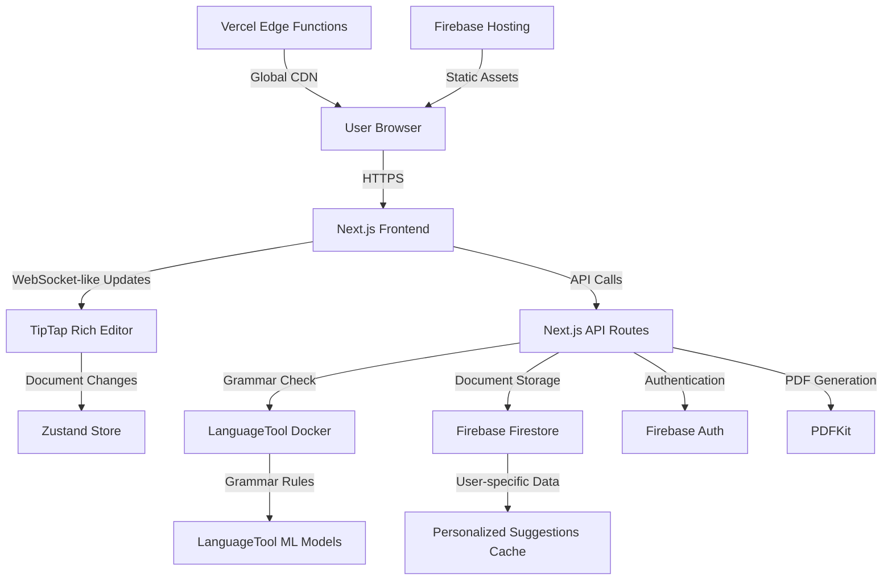

# WordWise: Technical Architecture Overview

## System Architecture



## Technology Stack Rationale

### Frontend Architecture

**Next.js 14 (App Router)**
- **Why:** Server-side rendering for SEO and performance
- **Why:** Built-in API routes eliminate need for separate backend
- **Why:** Edge functions for global low-latency responses
- **Why:** TypeScript support out-of-the-box

**TipTap Rich Text Editor**
- **Why:** Headless editor allows complete UI customization
- **Why:** ProseMirror foundation provides robust document manipulation
- **Why:** Plugin architecture enables custom grammar highlighting
- **Why:** Better performance than Draft.js for large documents

**Zustand State Management**
- **Why:** Lighter than Redux, simpler than Context API
- **Why:** TypeScript-first design
- **Why:** Minimal boilerplate for suggestion management
- **Why:** Excellent devtools and debugging

### Backend Services

**LanguageTool (Docker)**
- **Why:** Open-source, enterprise-grade grammar checking
- **Why:** Supports 20+ languages for future expansion
- **Why:** Local deployment for data privacy
- **Why:** Extensible rule system for custom writing guidelines
- **Why:** Docker ensures consistent deployment across environments

**Firebase Ecosystem**
- **Firestore:** Real-time document synchronization, offline support
- **Firebase Auth:** Secure, passwordless email-link authentication
- **Firebase Performance:** Built-in monitoring and analytics
- **Why Firebase:** Managed infrastructure, automatic scaling, security rules

**PDFKit for Export**
- **Why:** Pure JavaScript PDF generation (no server dependencies)
- **Why:** Full control over document styling and layout
- **Why:** Smaller bundle size than alternatives like Puppeteer

### Deployment & DevOps

**Vercel Platform**
- **Why:** Optimized for Next.js applications
- **Why:** Global edge network for low latency
- **Why:** Automatic deployments from Git
- **Why:** Built-in analytics and performance monitoring

## Personalized Feedback Loop

WordWise implements a personalized learning system through:

1. **User-Specific Suggestion Tracking**: Each suggestion interaction is stored with the user's UID in Firestore
2. **Pattern Recognition**: Common mistake patterns are identified per user
3. **Adaptive Prioritization**: Frequently dismissed rule types are deprioritized
4. **Learning Progress**: Successfully applied suggestions inform future recommendations
5. **Custom Rule Weighting**: LanguageTool rules are weighted based on user's writing style and error patterns

This creates a feedback loop where the system becomes more accurate and relevant for each individual user over time.

## Execution Phasing & Milestones

### Phase 1: Core Foundation (Weeks 1-2)
**Deliverables:**
- Next.js project setup with TypeScript
- Firebase Auth implementation
- Basic TipTap editor integration
- Firestore document storage

**Success Criteria:**
- User can sign in with email link
- Basic text editing functionality works
- Documents save to Firestore automatically

### Phase 2: Grammar Integration (Week 3)
**Deliverables:**
- LanguageTool Docker setup
- Grammar checking API integration
- Suggestion highlighting system
- Basic suggestion UI (accept/dismiss)

**Success Criteria:**
- Grammar suggestions appear within 2 seconds
- Inline highlights work correctly
- Users can interact with suggestions

### Phase 3: UI Polish & Export (Week 4)
**Deliverables:**
- Professional UI design implementation
- PDF/DOCX export functionality
- Keyboard shortcuts system
- Responsive design for mobile

**Success Criteria:**
- Professional appearance matches design mockups
- Export generates clean documents
- All keyboard shortcuts work correctly

### Phase 4: Documentation & Testing (Week 5)
**Deliverables:**
- Complete API documentation
- User guide and tutorials
- Accessibility testing and fixes
- Performance optimization

**Success Criteria:**
- All documentation is complete and accurate
- WCAG 2.1 AA compliance achieved
- Performance benchmarks met

### Phase 5: Deployment & Launch (Week 6)
**Deliverables:**
- Production deployment to Vercel
- Firebase security rules finalized
- Error monitoring setup
- User feedback collection system

**Success Criteria:**
- Application successfully deployed
- No critical bugs in production
- Monitoring systems operational

## Performance Optimizations

- **Debounced Grammar Checking**: 500ms delay prevents excessive API calls
- **Suggestion Caching**: Results cached by content hash to avoid repeated processing
- **Lazy Loading**: Editor components loaded only when needed
- **Optimistic Updates**: UI updates immediately, with server sync in background
- **Edge Caching**: Static assets cached globally via Vercel CDN

## Security Considerations

- **Authentication**: Firebase Auth with email verification
- **Authorization**: Firestore security rules ensure users can only access their own documents
- **API Protection**: Rate limiting on grammar checking endpoints
- **Data Privacy**: LanguageTool runs locally, no text sent to third parties
- **HTTPS Only**: All communications encrypted in transit

## Platform Integration Strategy

### Current Integration: HTML Clipboard
- **Copy as Markdown**: Clean Markdown export to clipboard for universal compatibility
- **Target Applications**: Google Docs, Microsoft Word, Notion, email clients
- **Data Format**: Standardized HTML with minimal styling for maximum compatibility

### Phase 2 Integrations: Direct API Access

#### Email Platform Integration
- **Gmail Add-on**: Browser extension for compose window integration
- **Outlook Plugin**: Native Office 365 add-in with real-time checking
- **Implementation**: Chrome extension with content script injection

#### Document Platform APIs
- **Google Docs API**: Direct suggestion insertion via Google Workspace
- **Microsoft Graph API**: Word Online integration for enterprise users
- **Notion API**: Block-level grammar checking integration

#### CMS & Publishing Platforms
- **WordPress Plugin**: Gutenberg block integration
- **Medium Integration**: Draft import/export with suggestion preservation
- **Ghost Publishing**: Custom editor plugin for bloggers

### Phase 3 Integrations: Workflow Embedding

#### Developer Tools
- **VS Code Extension**: Markdown and documentation file checking
- **GitHub Integration**: Pull request comment grammar checking
- **Slack Bot**: Message composition assistance

#### Educational Platforms
- **Canvas LTI**: Learning management system integration
- **Blackboard Plugin**: Assignment composition assistance
- **Google Classroom**: Student writing support tools

#### Enterprise Workflows
- **Salesforce**: Email template and proposal checking
- **HubSpot**: Marketing content optimization
- **Confluence**: Documentation quality assurance

### Technical Implementation Approach

#### API-First Design
```typescript
// Universal WordWise API
interface WordWiseAPI {
  checkGrammar(text: string): Promise<Suggestion[]>;
  applyFixes(text: string, suggestions: Suggestion[]): Promise<string>;
  getUserPreferences(userId: string): Promise<UserPrefs>;
}
```

#### Widget Embedding
```html
<!-- Embeddable WordWise Widget -->
<script src="https://wordwise.app/widget.js"></script>
<div data-wordwise-target="content"></div>
```

#### Webhook Integration
- **Real-time Processing**: Document updates trigger grammar checking
- **Batch Processing**: Scheduled grammar reviews for large content libraries
- **Notification System**: Alert users to content quality issues

### Business Model Integration

#### Freemium API Tiers
- **Free**: 1,000 suggestions/month, basic grammar
- **Pro**: 10,000 suggestions/month, style recommendations  
- **Enterprise**: Unlimited usage, custom rules, SSO integration

#### White-label Solutions
- **Custom Branding**: Partner companies can rebrand the interface
- **Custom Rules**: Industry-specific grammar and style guidelines
- **On-premise Deployment**: Private cloud or self-hosted options

## Future Architecture Considerations

- **Horizontal Scaling**: LanguageTool can be load-balanced across multiple Docker instances
- **Multi-language Support**: Additional language models can be added to LanguageTool
- **Real-time Collaboration**: Firestore's real-time capabilities support collaborative editing
- **Mobile Apps**: Firebase SDKs enable native mobile app development
- **AI Integration**: OpenAI API integration ready for advanced writing suggestions 